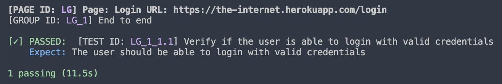

# vaah-webdriverio

Helpful classes to reduce code &amp; accelerate speed for writing test cases for WebDriver.io

## Objectives

- Reduce code for `selecting` elements and verifying `asserts`
- Generate unique `page id`, `group id` and `test case id`
- Run `test cases` based on `page id`, `group id` or `test id`
- Generate a well `formated` report

## Setup & Configure

### Step 1: Clone or add as this repo as submodule to root of `webdriverio` tests folder with folder name `vaah-webdriverio`

**Refer**: [Clone project](https://youtu.be/7UQFlr39xAk)

### Step 2: Configure `wdio.env.sample.js`

- Rename `wdio.env.sample.js` to `wdio.env.js`
- Move `wdio.env.js` to the `root` folder of your project or where `wdio.conf.js` exist

**Refer**: https://youtu.be/tq4XGpKV3Ws

### Step 3: Install Dependencies

In this steps, we will install few packages that will be used by the automation scripts. To install the required dependencies and configure package.json file, follow the steps given below:

1. Run following commands in the terminal of the Code Editor. (Make sure the path is set to your project directory)
   ```shell
   npm install axios chalk cli-color cross-env ts-node typescript wdio-wait-for --save-dev
   ```
2. In `package.json` file, replace the code in script with the below code:
   ```json
   "scripts": {
    "wdio": "cross-env wdio run ./wdio.conf.js",
    "wdio-debug": "cross-env NODE_WDIO_DEBUG=true wdio run ./wdio.conf.js",
    "wdio-is_human": "cross-env NODE_WDIO_IS_HUMAN=true wdio run ./wdio.conf.js"
    }
   ```
3. Also add "type":"module" inside `package.json` file. Refer to the code below
   ```json
    ...
    "type": "module",
    "devDependencies": {
        ...
    }
   ```

**Note:** Since we have add `"type": "module"` in the package.json file, we need to update the import statements on all files. Also we need to update the class declaration statement for each classes. Refer to the example mentioned below:

- Previous import statement: `const Page = require('./page')`. New import statement: `import Page from './page.js'`
- Previous class declaration: `class LoginPage extends Page`. New class declaration: `export default class LoginPage extends Page`
- Remove `export` statement from the page object files if added. This will be added at the bottom. Eg. `module.exports = new LoginPage();`.

### Step 4: Include `wdio.env.js`

In `wdio.conf.js`, include `wdio.env.js` file and update the `env`, `baseUrl`, `logLevel` and `capabilities` variables:

```js
import env from "./wdio.env.js";
const envObj = new env();
const params = envObj.getParams();

export const config = {
    ...
    env: params,
    capabilities: params.capabilities,
    logLevel: params.log_level,
    baseUrl: params.base_url,
    ...
}

```

We also need to update the **reporter** object in `wdio.conf.js` file. Locate the **reporter** object and update this with the following statment:

```js
export const config = {
    ...
    baseUrl: params.base_url,
    ...
    reporters:  [     
        ['spec',
            {
            symbols: {
                passed: `
[✓] PASSED: `,
                failed: `
[✖] FAILED: `,
            },
            realtimeReporting: false,
            showPreface: false
            },
        ]
    ],
    ...
}
```

**Refer**: https://youtu.be/Fop5JRTCXDA

### Step 5: Update `wdio.env.js` file

In `wdio.env.js` tester should set the base URL based on their test environment. // Make sure that the URL ends with '/'.

```js
 this.params = {
            debug: false,
            is_human: true,
            is_human_pause: 1000,
            env: null,
            log_level: 'error',
            small_pause: 2000,
            medium_pause: 5000,
            long_pause: 10000,
            base_url: '',       // Instead of '', insert your base URL.
            version: null,
            capabilities: [
            ...
```

**Refer**: https://youtu.be/jA_JwsfaRLQ

### Step 6: Create `data` Directory and Add Data files

In this step, we will create a new directory called **data** inside **tests** on your webdriverio testing project.

This folder will contain all the data files for seperate pages. In these file, all the details regarding the test case, such as test case name, expect message, test case ID, group ID and assert value.

We also add all the locators and test data used for the test cases.

Each webpage must have separate data files with locators, test data, test case descriptions, etc.

The naming convention for the data file is: `pagename.js`. Eg. `login.js` or `signup.js` or `registration.js`.

To understand this better, let's look at a sample data file for a registration page:

```js
import Page from '../vaah-webdriverio/Page.js'

export default class Registration extends Page{
    constructor() {
        super();
        this.params = {
            group: {
                count: null,
                name: null,
            }
        }
        this.element = {
            cookie_accept_btn_id: 'onetrust-accept-btn-handler',
            page_heading_text: 'h1=Create my account',
            welcome_message_class: 'register-wrapper',
            title_label_span: 'span*=Title',
            title: '//*[text()="Title*"]/../select',
            first_name_label: 'label*=First name',
            first_name_id: 'firstName',
            last_name_label: 'label*=Last name',
            last_name_id: 'lastName',
            landline_id: 'landline',
            mobile_label: 'label*=Mobile',
            mobile_id: 'mobile'
        }
        this.value = {
            title: 'Mr',
            first_name: 'Tom',
            last_name: 'howard',
            landline: '442045780871',
            invalid_password: 'testing',
            placeholder: 'placeholder',
        }
        this.params.page = {
            id: "RG",
            name: "Registration",
            url : this.base_url+"register"
        }
        this.groups = [
            {
                count: 1,
                name: "UI",
                tests: [
                    {
                        count: 1.1,
                        name: "Verify the URL of the registration page",
                        expect: "The URL should be: "+this.params.page.url,
                        assert: this.params.page.url
                    },
                    {
                        count: 1.2,
                        name: "Verify the title of the registration page",
                        expect: "The title should be: Toolstation",
                        assert: "Toolstation"
                    },
                    {
                        count: 1.3,
                        name: "Verify if the heading is visible on the registration page or not",
                        expect: "The heading should be visible on the registration page",
                    }
                ]
            }
        ]
    }
}
```

The above is an example of a data file for a registration page of a website. Note that we import `Page.js` file from `vaah-webdriverio` directory.

The class name in the file must be the name of the page. It should also extend the Page class from Page.js file in vaah-webdriverio directory.

#### Locators and Values

All the locators for the elements present on a particular page should be added to the `this.element` object in the constructor. Only the value of the locator should be added for each element.

Test data used within the automation script for that page should be added to the `this.value` object.

Also notice the naming convention of the locators and values.

**Note:** The QA should analyze and create multiple data files for different pages and add all the locator values based on the type. Similary, they should also add the test data in this file as well. For reference, kindly follow the steps shown in thw video down below.

**Demo:** [How to add locators in data file](https://youtu.be/NJIEN1WHtlg)

**Demo:** [How to add test data/values in data file](https://youtu.be/ZXd7zCl8kOk)

#### Page Details

The Page ID, Name and URL which was visible in the custom spec report mentioned in the section should be added in the `this.params.page` object.

Refer to `this.params.page` object in the constructor.

```js
this.params.page = {
    id: 'RG',                          // Page ID
    name: 'Registration',              // Page Name
    url : this.base_url+'register'    // Page URL (base_url referenced from wdio.env.js)
}
```

**Note:** The QA need to add the ID, name and url of the pages based on the page name.

**Demo:** [How to add page id, name and url in the data file](https://youtu.be/TK81CLl_fXk)

#### Test Group

The data file also contains test groups with group ID, Name and test cases inside each group. All these details should be added to the this.group object. Refer to the code snippet below:

```js
this.groups = [
            {
                count: 1,           // Group ID
                name: "UI",         // Group Name
                tests: [
                    {
                        count: 1.1,
                        name: "Verify the URL of the registration page",
                        expect: "The URL should be: "+this.params.page.url,
                        assert: this.params.page.url
                    }
        ]
    }
]
```

**Note:** The QA need to analyse the written test cases and devide them in different groups if required.

**Demo:** [How to add group details in data file](https://youtu.be/jr9JyLLiL-U)

#### Test Case Description

In this section, we will learn about the process of writing test case details such as test case id, name, expect message and assert value. All these details should be added inside the object tests: [ ].

```js
tests: [
    {
        count: 1.1,                              
        name: "Verify the URL of the registration page",
        expect: "The URL should be: "+this.params.page.url,
        assert: this.params.page.url
    }
```

In the code snippet above, we have four objects.

- **count:** Unique test case ID for each test case.
- **name:** Name of the test case
- **expect:** Expect message for the test case.
- **assert:** Assert value of the test case.\

**Note:**

- Some of the test cases may not contain the assert object, such as the test case: 'Verify if the title is visible on the page or not'. For these test cases, only count, name, and expect objects should be added.
- If the count of the test case reaches 1.9. Then, the upcoming test cases should begin with 2.1 and not 1.10. After this, it should go on like 2.2, 2.3, etc.

**Note:** The QA need to add the test case description based on the previously written test cases. The assert object is optional. If we do not have any value to assert in the test case, we can remove this object from the test cases.

**Demo:** [How to add test case description in the data file](https://youtu.be/jQYQzv9dTCI)

### Step 7: Extend `pageobjects` and variables in `constructor`

Extend all your `pageobjects` to `import Page from '../vaah-webdriverio/Page.js';`,

**Note:** If there is already a file with name 'Page.js' that is being used by the automation script, then kindly refactor the file and variable name to something else. For 'Page.js', we will always use file in 'vaah-webdriverio' directory.  

Example: For a pageobject file - `pageobjects/Login.page.js`, we have to import and extend Page.js file.

Also, import `Selector.js` and `Assert.js` files on all your pageobject files. Do not extend these files. Only extend `Page.js` file in vaah-webdriverio directory.

```js
import Page from '../webdriverio-hepler/Page.js'
import Selector from '../webdriverio-helper/Selector.js'
import Asserts from "../webdriverio-helper/Asserts.js";

export default class LoginPage extends Page {

    constructor() {
        super();
        this.params.page.id = "LI"; // Page ID, Please keep this unique for all the pages.
        this.params.page.name = "Login";
        this.params.page.path = "login";
        this.params.page.url = this.base_url + this.params.page.path;
    }

    open (url=null) {
        if(url)
        {
            this.page.url = url
        }
        return super.open(this.page.url);
    }
    ...
}
```

**Demo:** [How to add page details in page object file](https://youtu.be/KbJHFRUKQ3g)

The page object file contains all the methods for each test case and some additional methods as needed.

All the functionalities such as locating an element, opening a URL, clicking a button and other test logics. All these should be added in this page object file.

Let's look at a sample page object file for better understanding.

```js
import Page from '../vaah-webdriverio/Page.js'
import Selector from '../vaah-webdriverio/Selector.js'
import Assert from "../vaah-webdriverio/Assert.js";

let Asserts = new Assert();
let Sl = new Selector();

export default class RegistrationPage extends Page{
    constructor() {
        super();
        this.params.page.id = "RG";
        this.params.page.name = "Registration";
        this.params.page.path = "register";
        this.params.page.url = this.base_url+this.params.page.path;
    }

    async open() {
        await browser.maximizeWindow();
        await Asserts.pauseIfHuman();
        await super.open(this.params.page.url);
    }

    async firstNameFieldTypeFunctionality(data, assert){
        await Sl.id(data.element.first_name_id).setValue(data.value.first_name);
        await expect(Sl.id(data.element.first_name_id)).toHaveValueContaining(assert);
        await expect(Sl.id(data.element.first_name_id)).toHaveText(expect.stringContaining(assert));
    }

    async lastNameFieldTypeFunctionality(data, assert){
        const last_name = await Sl.id(data.element.last_name_id);
        await last_name.setValue(data.value.last_name);
        await expect(last_name).toHaveText(expect.stringContaining(assert));
    }
}
```

#### How to locate elements

In the code above, you can see that we imported a file named Selector.js and used this file to locate all the elements using the methods inside it.

Here we will use the objects we created in the **data file** for different elements under `this.element`.

**Note:** The data object in the method: `firstNameFieldTypeFunctionality` and `lastNameFieldTypeFunctionality` added above are the reference object from the Data file of the perticular page. We do not import the data file in this pageobject file. Instead we have a seperate **Spec** file, from which we import and call the these menthods with data file as an argument. You will get know about this in detail on further sections of this document.

```js
export default class Selector{

    //-----------------------------------------------------
    id(id)
    {
        return $("#"+id);
    }
    //-----------------------------------------------------
    class(name)
    {
        return $("."+name);
    }
    //-----------------------------------------------------
    $(selector)
    {
        return $(selector);
    }
    ...

```

In the code snippet above, you can see that we have different locators as a method. We have locators for ID, class name, attribute name and value, and much more.

We just have to import the file and make the function calls inside it. Refer to the example below:

```js
import Selector from 'Selector.js'
let Sl = new Selector();

const element = await Sl.id('element_id');  // Here we have used 'element_id' but we should use the locator objects from data file.

```

Similarly, we can use the remaining functions inside `Selector.js` as needed. Refer to the table given below to know more about the usage of the selectors:

| Selector | In Selector.js                                                                                                       | Use with pageobject                                                                                                                                |
| -------- | -------------------------------------------------------------------------------------------------------------------- | -------------------------------------------------------------------------------------------------------------------------------------------------- |
| testid   | `testid(name,value=null) { let el = this.attr('data-testid', name); if(value) { el.setValue(value) } return el; }` | `sl.testid("royal_email", "demo@test.com");` or `sl.testid("royal_email").setValue("demo@test.com")`                                           |
| id       | `id(id) { return $("#"+id); }`                                                                                     | `sl.id(elements.login.button_signin).click();`                                                                                                   |
| class    | `class(name) { return $("."+name); }`                                                                              | `sl.class(elements.login.button_signin).click();`                                                                                                |
| \$       | `$(selector){return $(selector);}`                                                                                 | `expect(sl.$(elements.login.remember_me_checkbox)).toBeSelected();`                                                                              |
| attr     | `attr(attribute, value){return$('['+attribute+'="'+value+'"]'); }`                                                 | `sl.attr("class", elements.login.button_signin).click();`                                                                                        |
| name     | `name(name,value=null) { let el = this.attr('name', name); if(value) { el.setValue(value) } return el; }`          | `sl.name(elements.login.signin_email, "tomsmith");` or `sl.name(elements.login.signin_email).setValue("tomsmith");`                            |
| wdio     | `wdio(name,value=null) { let el = this.attr('data-wdio', name); if(value) { el.setValue(value) } return el; }`     | `sl.wdio(elements.login.signin_email, "tomsmith");` or `sl.wdio(elements.login.signin_email).setValue("tomsmith")`                             |
| dusk     | `dusk(name,value=null) { let el = this.attr('dusk', name); if(value) { el.setValue(value) } return el; }`          | `sl.dusk(elements.login.signin_password, "SuperSecretPassword")` or `sl.dusk(elements.login.signin_password).setValue("SuperSecretPassword");` |
| role     | `role(name) { return this.attr('role', name); }`                                                                   | `sl.role(elements.login.button_signin).click();`                                                                                                 |

#### Test Methods

Inside the Data file, we should include all the methods used for the test cases. Let's look at these methods in detail:

1. **constructor():** In the constructor, we have to add page id, name and path. We also need to add the complete URL of the page by appending the baseUrl and page path.
2. **Open()**: This method should be included in every page object file to open the specific URL of the page, which should come from `this.params`.
3. **Test methods:** These include all the methods required for each test case. For locating an element, we have to use selector methods and the locators added to the data file inside `this.element`. Similarly, for assertions and test data, we have to use assert and `this.value` objects.

**Note:** The QA need to remove all the hardcoded locators and values from the pageobject files, add those in the data file, import required files such as Assert.js, Selector.js, Page.js etc. Use Selector class to locate elements. They have to refactor test methods.

**Demo:** [How to add selectors in page object file](https://youtu.be/EuvjIh5MMyE)

**Demo:** [How to refactor test methods in page object file](https://youtu.be/bvEJbzGfqKA)

**Note:** Change all pause statement from **Asserts.pause()** to **Asserts.pauseIfHuman()**.

### Step 8: Create Spec files

In this step, we will refactor and remove all the test logic, functionalities from the spec files. This file will only contain the method calls for the methods we have created in page object file.

Each page will have a seperate spec file just like it has seperate data and page object files. The naming convention should be `pagename.spec.js`. Eg. `login.spec.js`.

The spec file is the starting point of execution of your automation script.

We have to import the data file and the page object file that we have created for a page, as mentioned in the previous sections.

Refer to the sample spec file added below:

```js
import RegistrationPage from '../pageobjects/registration.page.js'
import Registration from '../data/registration.js'
import Assert from "../vaah-webdriverio/Assert.js";

let Page = new RegistrationPage();
let Data = new Registration();
let Asserts = new Assert();
let params = Data.params;
let inputs;

params.group = Data.groups[0];
describe(Page.groupId(params), () => {

    params.test = Data.groups[0].tests[0];
    it(Page.testId(params), async () => {
        inputs = Data.groups[0].tests[0];
        await Page.open();
        await Asserts.pageUrl(inputs.assert);
    })

    params.test = Data.groups[0].tests[1];
    it(Page.testId(params), async () => {
        inputs = Data.groups[0].tests[1];
        await Page.open();
        await Asserts.pageTitle(inputs.assert);
    })

    params.test = Data.groups[0].tests[2];
    it(Page.testId(params), async () => {
        inputs = Data.groups[0].tests[2];
        await Page.open();
        await Page.mandatorySymbolVisibility(Data, inputs.assert);
    })
})
```

There are several points to note in this file. Let's look at these one by one:

- The data file `registration.js` is imported and assigned to a variable **Data**.
- The page object file `registration.page.js` is imported and assigned to a variable **Page**.
- The params object inside `registration.js` file is assigned to a new variable, **params**.
- For the test suite name: the group object added in the data file is passed as an argument to the function **groupId()** of file `Page.js`.
- Similarly, for test case name, the test object inside the group is passed as an argument to the function **testId()** of the `Page.js` file.
- Notice that the first two statements inside the **it** block were
  ```js
    inputs = Data.groups[0].tests[2];
    await Page.open();
  ```

  - The first statement assigns the test object inside a group in the data file to the `inputs` variable.
  - The second statement is used to call the open() method inside the page object file.
- After this, the last statement inside the **it** block is the method call for the test case method created in the page object file.
- The variable **Data** is passed as an argument in the method `Page.mandatorySymbolVisibility`.
- Similarly, we have to pass the **Data** variable whenever we make a call to a function inside the page object file.
- We have to update the `params.test` object for every test case or it block.
- We have to update the `params.group` object for every test group or describe block.

**Demo:** [How to add spec files](https://youtu.be/3Z7Raxws68A)

### Step 9: Execute tests

Now, you can run the test via:

```sh
npx wdio --spec ./test/specs/login.spec.js
```

**Note:** Kindly verify the path before execution.

**Demo:** https://youtu.be/PaMVKUvkYu8

or run all tests via:

```shell
npm run wdio
```

**Demo:** https://youtu.be/nNiXkLNRYEs

The Demo shows how a passed and failed test cases will be represented.

#### Step 10: Result



It contains:

```
[PAGE ID: LG]
[GROUP ID: LG_1]
[TEST ID: LG_1_1.1]
```

If you need to run tests based on `page id`, `group id` or `test id`, you can use following command:

```shell
npx wdio --mochaOpts.grep <page id>
e.g. npx wdio --mochaOpts.grep LG // This will run all the test cases under the Page with Page ID LG
Demo: https://youtu.be/wiNbPLZeH3k

npx wdio --mochaOpts.grep <group id>
e.g. npx wdio --mochaOpts.grep LG_1 // This will run all the test cases under the Group with Group ID LG_1
Demo: https://youtu.be/9eWWYWBRFBQ

npx wdio --mochaOpts.grep <test id>
e.g. npx wdio --mochaOpts.grep LG_1_1.1 // This will run only one test cases which contains Page ID 'LG' having Group ID 1 and Test ID starting with 1.1
Demo: https://youtu.be/aln6ZeNKvlI
// Note: If you have test case with test ID as LG_1_11, LG_1_12... LG_1_19, these tests will also run if you provide the test ID as LG_1_1
// To avoid this situation you can use a keyword to run a single test, but make sure to keep the keyword unique otherwise all the test cases having that keyword will run while executing tests. 
```

or you can even run the test cases based on a specific keyword:

```npx
e.g. npx wdio --mochaOpts.grep smoke
```
**Demo:** https://youtu.be/6YOUdSy7D48

#### Possible error

```
@wdio/runner: Error: Failed to create session.
session not created: This version of ChromeDriver only supports Chrome version 96
```

If this error occurrs that means your `wdio-chromedriver-service` and `chromedriver` dependencies are outdated and those need to be updated.

<br/>

## Support us

Please consider starring the project to show your ❤️ and support.

[WebReinvent](https://webreinvent.com) is a web agency based in Delhi, India. You'll find an overview of all our open source projects [on github](https://github.com/webreinvent).
